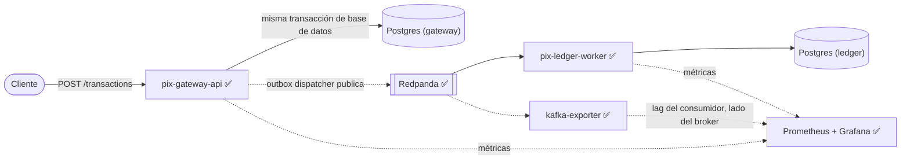

# PIX Payment Gateway

[](https://github.com/leon-lourenco/pix-payment-gateway/actions/workflows/ci.yml)

**Case study:** [leon-lourenco.github.io/pix-payment-gateway](https://leon-lourenco.github.io/pix-payment-gateway/) — la ejecución real de inyección de fallos, la arquitectura y las tres decisiones de diseño en una lectura de dos minutos.

**Leer en:** [English](README.md) | [Português](README.pt-BR.md) | [Español](README.es.md)

Un gateway de pagos estilo PIX, construido para demostrar patrones usados en plataformas de pago
reales — idempotencia, el outbox pattern, consistencia distribuida y observabilidad — sin
depender de ningún código propietario de cliente. Todo esto corre localmente; no hay demo
alojada ni infraestructura facturada por hora.

Este es un proyecto de portafolio de [Leonardo Lourenço Gomes](https://www.linkedin.com/in/leonardo-lourenço-gomes),
ingeniero backend senior, construido en público en fases delimitadas.

## Status

- [x] **Fase 1 — `pix-gateway-api`**: intake idempotente de transacciones, outbox pattern, Postgres, Testcontainers.
- [x] **Fase 2 — `pix-ledger-worker`**: consumidor Redpanda (compatible con la API de Kafka), ledger de partida doble, `docker-compose up` completo.
- [x] **Fase 3 — Observabilidad**: Prometheus + Grafana, documentación Swagger/OpenAPI, una ejecución real de inyección de fallos.

Las tres fases están implementadas y corriendo de punta a punta.

## Arquitectura



Dos servicios, cada uno con su propia base de datos — sin schema compartido entre ellos.
`pix-gateway-api` recibe una transacción, la persiste, y escribe un evento de outbox en la misma
transacción de base de datos. `pix-ledger-worker` consume ese evento desde Redpanda y registra
un asiento de partida doble en el ledger. Separar el flujo de esta forma es lo que hace que la
fase de observabilidad tenga sentido después — hay un salto asíncrono real que instrumentar, no
dos servicios dibujados en una pizarra.

## Decisiones de diseño

### La idempotencia la garantiza la base de datos, no una verificación previa

Una implementación ingenua verifica "¿ya existe esta clave de idempotencia?" e inserta si no.
Esa verificación tiene una carrera: dos solicitudes concurrentes con la misma clave pueden pasar
la verificación antes de que ninguna haya escrito nada todavía. La garantía real aquí es la
restricción `UNIQUE` sobre `idempotency_key`
([V1\_\_init.sql](pix-gateway-api/src/main/resources/db/migration/V1__init.sql)); quien pierde
la carrera falla al insertar, y el servicio recurre a leer la fila que creó el ganador.

Esa lectura de respaldo tiene que ejecutarse en una **transacción separada**. En Postgres, una
vez que una sentencia falla dentro de una transacción, el resto de esa transacción queda
abortado hasta el rollback — así que la lectura no puede ocurrir en la misma transacción que la
inserción fallida. [`TransactionService`](pix-gateway-api/src/main/java/com/pixgateway/application/TransactionService.java)
usa `TransactionTemplate` explícitamente por esta razón, en lugar de `@Transactional` en un solo
método.

Cubierto por [`TransactionIdempotencyIntegrationTest`](pix-gateway-api/src/test/java/com/pixgateway/TransactionIdempotencyIntegrationTest.java),
que dispara N solicitudes concurrentes con la misma clave de idempotencia (sincronizadas con un
`CountDownLatch` para que realmente compitan entre sí) y verifica que se crean exactamente una
transacción y un evento de outbox.

### Outbox pattern

Escribir en la base de datos y publicar en un message broker son dos operaciones separadas;
hacer ambas de forma confiable requiere una transacción distribuida o aceptar que una de ellas
puede fallar independientemente de la otra (el problema del "dual write"). El outbox pattern
evita esto escribiendo el evento en una tabla dentro de la *misma* transacción de base de datos
que la fila de negocio, y luego un poller separado ([`OutboxDispatcher`](pix-gateway-api/src/main/java/com/pixgateway/infrastructure/outbox/OutboxDispatcher.java))
lo publica después. Si el paso de publicación falla o el proceso se cae a mitad del despacho, el
evento sigue ahí en la tabla, sin publicar, listo para reintentarse.

El dispatcher no sabe ni le importa a qué está publicando — depende de un puerto
[`TransactionEventPublisher`](pix-gateway-api/src/main/java/com/pixgateway/application/port/TransactionEventPublisher.java).
El adaptador detrás de él hoy es [`KafkaTransactionEventPublisher`](pix-gateway-api/src/main/java/com/pixgateway/infrastructure/outbox/KafkaTransactionEventPublisher.java),
que publica en Redpanda. Su `publish()` bloquea hasta la confirmación del broker antes de
retornar — el contrato del puerto lo exige, ya que el dispatcher marca un evento como publicado
tan pronto `publish()` retorna; un envío "disparar y olvidar" que fallara en silencio dejaría un
evento perdido para siempre.

### Entrega at-least-once, consumo idempotente

Kafka (y Redpanda) garantizan entrega at-least-once, no exactly-once: un consumidor puede ver el
mismo mensaje más de una vez, comúnmente después de un rebalanceo. `pix-ledger-worker` trata
esto como el caso normal, no como una excepción. Una transacción siempre produce exactamente un
asiento `DEBIT` y uno `CREDIT`
([`LedgerEntry`](pix-ledger-worker/src/main/java/com/pixledger/domain/LedgerEntry.java)); la
restricción única sobre `(transaction_id, direction)` hace que un mensaje reenviado choque en la
inserción del débito, y — como ambas inserciones ocurren dentro de un único bloque
`TransactionTemplate` en [`LedgerService`](pix-ledger-worker/src/main/java/com/pixledger/application/LedgerService.java) —
todo el asiento hace rollback antes de siquiera intentar insertar el crédito. El ledger nunca
termina con la mitad de un par. [`LedgerPostingIntegrationTest`](pix-ledger-worker/src/test/java/com/pixledger/LedgerPostingIntegrationTest.java)
reenvía el mismo mensaje dos veces contra un broker real y confirma que la segunda vez es un
no-op.

### Una base de datos por servicio

`pix-gateway-api` y `pix-ledger-worker` tienen cada uno su propia instancia de Postgres — sin
schema compartido, sin pool de conexiones compartido. Solo se relacionan a través del contrato
JSON del tópico `transactions.created`, no por ningún código Java ni tabla de base de datos que
un servicio pueda alcanzar del otro.

### El lag del consumidor hay que medirlo del lado del broker, no del cliente

La forma obvia de exponer el lag del consumidor de Kafka es la propia métrica de Micrometer,
`kafka_consumer_fetch_manager_records_lag`, vinculada automáticamente por Spring for Apache
Kafka — y funciona, justo hasta el momento en que deja de hacerlo: esa métrica la reporta *el
propio proceso consumidor*. Detén `pix-ledger-worker` para simular una interrupción y la métrica
no sube, simplemente deja de actualizarse, porque no queda ninguna JVM para reportarla. Para un
dashboard cuyo objetivo entero es mostrar qué pasa *mientras el consumidor está caído*, eso es
inútil.

[`kafka-exporter`](https://github.com/danielqsj/kafka-exporter) resuelve esto preguntándole
directamente a Redpanda — `log-end-offset - committed-offset` por consumer group, calculado del
lado del broker, así que sigue reportando números reales esté `pix-ledger-worker` activo o no.
El panel de Grafana consulta `kafka_consumergroup_lag_sum{consumergroup="pix-ledger-worker"}`,
no la métrica de Micrometer.

### El dinero como centavos enteros

Los montos se almacenan como `long amountCents`, no como un tipo de punto flotante, para
mantener el ledger libre de errores de redondeo.

## Stack técnico

Java 21, Spring Boot 4.1, Spring Data JPA, Flyway, PostgreSQL, Spring for Apache Kafka,
Redpanda, Testcontainers, JUnit 5, Docker Compose, Prometheus, Grafana, kafka-exporter,
springdoc-openapi (Swagger UI), k6. El Maven Wrapper está commiteado en ambos servicios, así que
`./mvnw` funciona sin necesidad de instalar Maven.

## Cómo ejecutarlo

### Tests

```bash
cd pix-gateway-api    # o pix-ledger-worker
./mvnw test
```

Los tests de integración de cada servicio levantan Postgres y Kafka reales vía Testcontainers —
sin configuración manual — pero necesitan un daemon de Docker corriendo localmente.

### La stack completa

```bash
docker compose up -d --build
```

Levanta ambas instancias de Postgres, Redpanda, y los dos servicios. La primera vez, construye
las dos imágenes de los servicios (build Maven multi-stage, así que descarga las dependencias
desde cero — espera unos minutos); después de eso es rápido. Luego:

```bash
curl -X POST http://localhost:8080/transactions \
  -H "Content-Type: application/json" \
  -H "Idempotency-Key: $(python3 -c 'import uuid; print(uuid.uuid4())')" \
  -d '{"payerAccount":"alice@example.com","payeeAccount":"bob@example.com","amountCents":5000}'
```

devuelve `202` con la transacción, y en un par de segundos el mismo id de transacción aparece
como un par balanceado en la base de datos del ledger:

```
$ docker exec pix-payment-gateway-postgres-ledger-1 psql -U pixledger -d pixledger \
    -c "SELECT transaction_id, account, direction, amount_cents FROM ledger_entries;"

            transaction_id            |      account      | direction | amount_cents
--------------------------------------+--------------------+-----------+--------------
 4584deaa-0ce7-495c-b1e0-1495ded01724 | alice@example.com  | DEBIT     |         5000
 4584deaa-0ce7-495c-b1e0-1495ded01724 | bob@example.com    | CREDIT    |         5000
```

Esa es una ejecución real contra la stack del compose el 16/08/2026, no un ejemplo escrito a mano.

## API

`pix-gateway-api` expone un único endpoint hoy.

```
POST /transactions
Header: Idempotency-Key: <cualquier string única generada por el cliente>
Content-Type: application/json

{
  "payerAccount": "alice@example.com",
  "payeeAccount": "bob@example.com",
  "amountCents": 5000
}
```

Devuelve `202 Accepted`:

```json
{
  "id": "5f2c1e2a-...",
  "status": "PENDING",
  "payerAccount": "alice@example.com",
  "payeeAccount": "bob@example.com",
  "amountCents": 5000,
  "createdAt": "2026-08-15T19:04:11.123Z"
}
```

Reenviar la misma `Idempotency-Key` devuelve la transacción original en vez de crear un
duplicado, sea el reenvío secuencial o concurrente con la solicitud original.

El `202` solo significa que la transacción fue aceptada y registrada — el asiento en el ledger
ocurre de forma asíncrona, un momento después, cuando `pix-ledger-worker` consume el evento
resultante.

El Swagger UI interactivo (springdoc-openapi) está en `http://localhost:8080/swagger-ui.html`
con la stack levantada, con los schemas de solicitud/respuesta y ejemplos documentados en el
endpoint — no los valores por defecto autogenerados y sin contexto.

## Observabilidad

Prometheus (`http://localhost:9090`) hace scrape del `/actuator/prometheus` de ambos servicios
más del `kafka-exporter`; Grafana (`http://localhost:3000`, acceso anónimo como admin — esta
stack solo se conecta en localhost) viene con un dashboard ya provisionado que cubre throughput
de transacciones, latencia p95 en `POST /transactions`, y el lag del consumidor Kafka de
`pix-ledger-worker`.

### Una ejecución real de inyección de fallos

Para probar que el panel de lag realmente significa algo, no solo que dibuja una línea: con la
stack ya procesando tráfico, se detuvo `pix-ledger-worker`, se enviaron 15 transacciones contra
`pix-gateway-api` (que no le importa si hay algo consumiendo desde Redpanda o no — el outbox
dispatcher publica en Kafka de todas formas), y se volvió a levantar el worker.


| Momento | `kafka_consumergroup_lag_sum` |
|---|---|
| Baseline | 0 |
| `pix-ledger-worker` detenido, 15 transacciones enviadas | 15 |
| ~20s después de que `pix-ledger-worker` reinició | 0 |

Números reales, extraídos directamente de la API `query_range` de Prometheus para esa ejecución,
no dibujados a mano — y el ledger lo confirma de forma independiente: `SELECT COUNT(*) FROM
ledger_entries` mostró exactamente 2 filas (una `DEBIT`, una `CREDIT`) por transacción una vez
que el worker se puso al día, sin asientos huérfanos provenientes de la interrupción.

Reprodúcelo tú mismo:

```bash
docker compose stop pix-ledger-worker
# envía algunas transacciones (ver el ejemplo de curl arriba), luego
docker compose start pix-ledger-worker
# observa cómo drena:
curl 'http://localhost:9090/api/v1/query?query=kafka_consumergroup_lag_sum{consumergroup="pix-ledger-worker"}'
```

### Load test

[`load-test/create-transaction.js`](load-test/create-transaction.js) es un script de k6
(20 req/s, 2 minutos) contra `POST /transactions`:

```bash
docker run --rm --network pix-payment-gateway_default \
  -v "$PWD/load-test:/scripts" grafana/k6 run /scripts/create-transaction.js \
  --env BASE_URL=http://pix-gateway-api:8080
```

## Estructura del proyecto

```
pix-payment-gateway/
├── docker-compose.yml         2 Postgres + Redpanda + kafka-exporter + Prometheus + Grafana + los dos servicios
├── observability/
│   ├── prometheus/            configuración de scrape
│   └── grafana/provisioning/  provisionamiento de datasource + dashboard (JSON)
├── load-test/                 script de k6
├── docs/evidence/              gráfico de la inyección de fallos usado arriba
├── pix-gateway-api/
│   ├── Dockerfile
│   └── src/main/java/com/pixgateway/
│       ├── domain/            Transaction, OutboxEvent, TransactionStatus
│       ├── application/       TransactionService, port/TransactionEventPublisher
│       └── infrastructure/
│           ├── web/           TransactionController, OpenApiConfig, GlobalExceptionHandler, DTOs
│           ├── persistence/   repositorios Spring Data
│           └── outbox/        OutboxDispatcher, KafkaTransactionEventPublisher
└── pix-ledger-worker/
    ├── Dockerfile
    └── src/main/java/com/pixledger/
        ├── domain/            LedgerEntry, LedgerDirection
        ├── application/       LedgerService, TransactionCreatedEvent
        └── infrastructure/
            ├── persistence/   LedgerEntryRepository
            └── kafka/         TransactionCreatedListener
```
