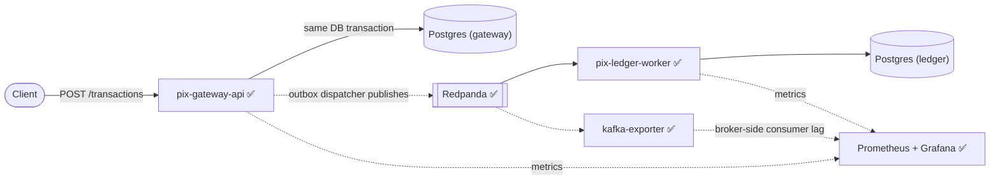
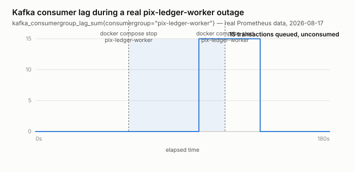

# PIX Payment Gateway

A PIX-style instant payment gateway, built to demonstrate patterns used in real payment
platforms — idempotency, the outbox pattern, distributed consistency, and observability —
without relying on any proprietary client code. Everything here runs locally; there is no
hosted demo and no infrastructure billed by the hour.

This is a portfolio project by [Leonardo Lourenço Gomes](https://www.linkedin.com/in/leonardo-lourenço-gomes),
a senior backend engineer, built in public in scoped phases.

## Status

- [x] **Phase 1 — `pix-gateway-api`**: idempotent transaction intake, outbox pattern, Postgres, Testcontainers.
- [x] **Phase 2 — `pix-ledger-worker`**: Redpanda (Kafka-API-compatible) consumer, double-entry ledger, full `docker-compose up`.
- [x] **Phase 3 — Observability**: Prometheus + Grafana, Swagger/OpenAPI docs, a real fault-injection run.

All three phases are implemented and running end-to-end.

## Architecture



Two services, each with its own database — no shared schema between them. `pix-gateway-api`
accepts a transaction, persists it, and writes an outbox event in the same database transaction.
`pix-ledger-worker` consumes that event from Redpanda and posts a double-entry ledger record.
Splitting the flow this way is what makes the observability phase meaningful later — there's an
actual asynchronous hop to instrument, not two services drawn on a whiteboard.

## Design decisions

### Idempotency is enforced by the database, not by a pre-check

A naive implementation checks "does this idempotency key already exist?" and inserts if not.
That check has a race: two concurrent requests with the same key can both pass it before either
has written anything. The real guard here is the `UNIQUE` constraint on `idempotency_key`
([V1\_\_init.sql](pix-gateway-api/src/main/resources/db/migration/V1__init.sql)); whichever
insert loses the race fails, and the service falls back to reading the row the winner created.

That fallback read has to run in a **separate transaction**. On Postgres, once a statement
inside a transaction fails, the rest of that transaction is aborted until it rolls back — so the
read can't happen in the same transaction as the failed insert. [`TransactionService`](pix-gateway-api/src/main/java/com/pixgateway/application/TransactionService.java)
uses `TransactionTemplate` explicitly for this reason, rather than `@Transactional` on a single
method.

Covered by [`TransactionIdempotencyIntegrationTest`](pix-gateway-api/src/test/java/com/pixgateway/TransactionIdempotencyIntegrationTest.java),
which fires N concurrent requests with the same idempotency key (synchronized with a
`CountDownLatch` so they actually contend) and asserts exactly one transaction and one outbox
event are created.

### Outbox pattern

Writing to the database and publishing to a message broker are two separate operations; doing
both reliably requires either a distributed transaction or accepting that one of them can fail
independently of the other (the "dual write" problem). The outbox pattern sidesteps this by
writing the event to a table in the *same* database transaction as the business row, then
having a separate poller ([`OutboxDispatcher`](pix-gateway-api/src/main/java/com/pixgateway/infrastructure/outbox/OutboxDispatcher.java))
publish it afterwards. If the publish step fails or the process crashes mid-dispatch, the event
is still sitting in the table, unpublished, ready to be retried.

The dispatcher doesn't know or care what it's publishing to — it depends on a
[`TransactionEventPublisher`](pix-gateway-api/src/main/java/com/pixgateway/application/port/TransactionEventPublisher.java)
port. The adapter behind it today is [`KafkaTransactionEventPublisher`](pix-gateway-api/src/main/java/com/pixgateway/infrastructure/outbox/KafkaTransactionEventPublisher.java),
which publishes to Redpanda. Its `publish()` blocks on the producer's broker acknowledgment
before returning — the port's contract requires that, since the dispatcher marks an event
published as soon as `publish()` returns; a fire-and-forget send that silently failed would let
a lost event be forgotten forever.

### At-least-once delivery, idempotent consumption

Kafka (and Redpanda) guarantee at-least-once delivery, not exactly-once: a consumer can see the
same message more than once, most commonly after a rebalance. `pix-ledger-worker` treats this as
the normal case rather than an edge case. A transaction always produces exactly one DEBIT and
one CREDIT [`LedgerEntry`](pix-ledger-worker/src/main/java/com/pixledger/domain/LedgerEntry.java);
the unique constraint on `(transaction_id, direction)` means a redelivered message collides on
the debit insert, and — because both inserts happen inside one `TransactionTemplate` block in
[`LedgerService`](pix-ledger-worker/src/main/java/com/pixledger/application/LedgerService.java) —
the whole posting rolls back before the credit insert is ever attempted. The ledger never ends
up with half of a pair. [`LedgerPostingIntegrationTest`](pix-ledger-worker/src/test/java/com/pixledger/LedgerPostingIntegrationTest.java)
replays the same message twice against a real broker and asserts it's a no-op the second time.

### Database per service

`pix-gateway-api` and `pix-ledger-worker` each get their own Postgres instance — no shared
schema, no shared connection pool. They're coupled only through the JSON contract on the
`transactions.created` topic, not through any Java code or database table either service can
reach into.

### Consumer lag has to be measured broker-side, not client-side

The obvious way to expose Kafka consumer lag is Micrometer's own
`kafka_consumer_fetch_manager_records_lag`, auto-bound by Spring for Apache Kafka — and it
works, right up until the point it doesn't: that metric is reported *by the consumer process
itself*. Stop `pix-ledger-worker` to simulate an outage and the metric doesn't climb, it just
stops updating, because there's no JVM left to report it. For a dashboard whose whole point is
showing what happens *while the consumer is down*, that's useless.

[`kafka-exporter`](https://github.com/danielqsj/kafka-exporter) fixes this by asking Redpanda
directly — `log-end-offset - committed-offset` per consumer group, computed broker-side, so it
keeps reporting real numbers whether `pix-ledger-worker` is up or not. The Grafana panel queries
`kafka_consumergroup_lag_sum{consumergroup="pix-ledger-worker"}`, not the Micrometer one.

### Money as integer cents

Amounts are stored as `long amountCents`, not a floating-point type, to keep the ledger free of
rounding error.

## Tech stack

Java 21, Spring Boot 4.1, Spring Data JPA, Flyway, PostgreSQL, Spring for Apache Kafka, Redpanda,
Testcontainers, JUnit 5, Docker Compose, Prometheus, Grafana, kafka-exporter, springdoc-openapi
(Swagger UI), k6. Maven Wrapper is committed in both services, so `./mvnw` works without
installing Maven.

## Running it

### Tests

```bash
cd pix-gateway-api    # or pix-ledger-worker
./mvnw test
```

Each service's integration tests spin up real Postgres and Kafka via Testcontainers — no manual
setup — but they do need a Docker daemon running locally.

### The full stack

```bash
docker compose up -d --build
```

Brings up both Postgres instances, Redpanda, and both services. First run builds the two service
images (multi-stage Maven build, so it downloads dependencies fresh — expect a few minutes);
after that it's fast. Then:

```bash
curl -X POST http://localhost:8080/transactions \
  -H "Content-Type: application/json" \
  -H "Idempotency-Key: $(python3 -c 'import uuid; print(uuid.uuid4())')" \
  -d '{"payerAccount":"alice@example.com","payeeAccount":"bob@example.com","amountCents":5000}'
```

returns `202` with the transaction, and within a couple of seconds the same transaction id shows
up as a balanced pair in the ledger's database:

```
$ docker exec pix-payment-gateway-postgres-ledger-1 psql -U pixledger -d pixledger \
    -c "SELECT transaction_id, account, direction, amount_cents FROM ledger_entries;"

            transaction_id            |      account      | direction | amount_cents
--------------------------------------+--------------------+-----------+--------------
 4584deaa-0ce7-495c-b1e0-1495ded01724 | alice@example.com  | DEBIT     |         5000
 4584deaa-0ce7-495c-b1e0-1495ded01724 | bob@example.com    | CREDIT    |         5000
```

That's a real run against the compose stack on 2026-08-16, not a hand-written example.

## API

`pix-gateway-api` exposes a single endpoint today.

```
POST /transactions
Header: Idempotency-Key: <any client-generated unique string>
Content-Type: application/json

{
  "payerAccount": "alice@example.com",
  "payeeAccount": "bob@example.com",
  "amountCents": 5000
}
```

Returns `202 Accepted`:

```json
{
  "id": "5f2c1e2a-...",
  "status": "PENDING",
  "payerAccount": "alice@example.com",
  "payeeAccount": "bob@example.com",
  "amountCents": 5000,
  "createdAt": "2026-08-15T19:04:11.123Z"
}
```

Replaying the same `Idempotency-Key` returns the original transaction instead of creating a
duplicate, whether the replay is sequential or concurrent with the original request.

The `202` response only means the transaction was accepted and recorded — posting to the ledger
happens asynchronously, a moment later, once `pix-ledger-worker` consumes the resulting event.

Interactive Swagger UI (springdoc-openapi) is at `http://localhost:8080/swagger-ui.html` once
the stack is up, with request/response schemas and examples documented on the endpoint —
not the bare auto-generated defaults.

## Observability

Prometheus (`http://localhost:9090`) scrapes both services' `/actuator/prometheus` plus
`kafka-exporter`; Grafana (`http://localhost:3000`, anonymous admin — this stack only ever binds
to localhost) ships with a provisioned dashboard covering transaction throughput, p95 latency on
`POST /transactions`, and `pix-ledger-worker`'s Kafka consumer lag.

### A real fault-injection run

To prove the lag panel actually means something, not just that it draws a line: with the stack
already handling traffic, `pix-ledger-worker` was stopped, 15 transactions were posted against
`pix-gateway-api` (which doesn't care whether anything is consuming from Redpanda — the outbox
dispatcher publishes to Kafka regardless), and the worker was started back up.



| Moment | `kafka_consumergroup_lag_sum` |
|---|---|
| Baseline | 0 |
| `pix-ledger-worker` stopped, 15 transactions sent | 15 |
| ~20s after `pix-ledger-worker` restarted | 0 |

Real numbers pulled straight from Prometheus's `query_range` API for that run, not hand-drawn —
and the ledger backs it up independently: `SELECT COUNT(*) FROM ledger_entries` showed exactly 2
rows (one DEBIT, one CREDIT) per transaction once the worker caught up, no orphaned half-postings
from the outage.

Reproduce it yourself:

```bash
docker compose stop pix-ledger-worker
# send some transactions (see the curl example above), then
docker compose start pix-ledger-worker
# watch it drain:
curl 'http://localhost:9090/api/v1/query?query=kafka_consumergroup_lag_sum{consumergroup="pix-ledger-worker"}'
```

### Load test

[`load-test/create-transaction.js`](load-test/create-transaction.js) is a k6 script (20 req/s,
2 minutes) against `POST /transactions`:

```bash
docker run --rm --network pix-payment-gateway_default \
  -v "$PWD/load-test:/scripts" grafana/k6 run /scripts/create-transaction.js \
  --env BASE_URL=http://pix-gateway-api:8080
```

## Project structure

```
pix-payment-gateway/
├── docker-compose.yml         2 Postgres + Redpanda + kafka-exporter + Prometheus + Grafana + both services
├── observability/
│   ├── prometheus/            scrape config
│   └── grafana/provisioning/  datasource + dashboard (JSON) provisioning
├── load-test/                 k6 script
├── docs/evidence/              fault-injection chart used above
├── pix-gateway-api/
│   ├── Dockerfile
│   └── src/main/java/com/pixgateway/
│       ├── domain/            Transaction, OutboxEvent, TransactionStatus
│       ├── application/       TransactionService, port/TransactionEventPublisher
│       └── infrastructure/
│           ├── web/           TransactionController, OpenApiConfig, GlobalExceptionHandler, DTOs
│           ├── persistence/   Spring Data repositories
│           └── outbox/        OutboxDispatcher, KafkaTransactionEventPublisher
└── pix-ledger-worker/
    ├── Dockerfile
    └── src/main/java/com/pixledger/
        ├── domain/            LedgerEntry, LedgerDirection
        ├── application/       LedgerService, TransactionCreatedEvent
        └── infrastructure/
            ├── persistence/   LedgerEntryRepository
            └── kafka/         TransactionCreatedListener
```
