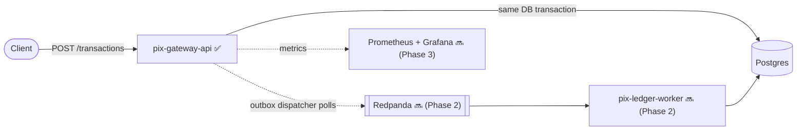

# PIX Payment Gateway

A PIX-style instant payment gateway, built to demonstrate patterns used in real payment
platforms — idempotency, the outbox pattern, distributed consistency, and observability —
without relying on any proprietary client code. Everything here runs locally; there is no
hosted demo and no infrastructure billed by the hour.

This is a portfolio project by [Leonardo Lourenço Gomes](https://www.linkedin.com/in/leonardo-lourenço-gomes),
a senior backend engineer, built in public in scoped phases.

## Status

- [x] **Phase 1 — `pix-gateway-api`**: idempotent transaction intake, outbox pattern, Postgres, Testcontainers.
- [ ] **Phase 2 — `pix-ledger-worker`**: Redpanda (Kafka-API-compatible) consumer, double-entry ledger, full `docker-compose up`.
- [ ] **Phase 3 — Observability**: OpenTelemetry/Prometheus/Grafana, a load test, and a fault-injection recording.

Only Phase 1 is implemented so far. The sections below describe what exists today; the rest
of this README will grow as each phase lands.

## Architecture



Two services are planned. `pix-gateway-api` accepts a transaction, persists it, and writes an
outbox event in the same database transaction. A `pix-ledger-worker` (Phase 2) will consume
that event from Redpanda and post a double-entry ledger record. Splitting the flow this way is
what makes the observability phase meaningful later — there's an actual asynchronous hop to
instrument, not two services drawn on a whiteboard.

## Design decisions

### Idempotency is enforced by the database, not by a pre-check

A naive implementation checks "does this idempotency key already exist?" and inserts if not.
That check has a race: two concurrent requests with the same key can both pass it before either
has written anything. The real guard here is the `UNIQUE` constraint on `idempotency_key`
([V1\_\_init.sql](pix-gateway-api/src/main/resources/db/migration/V1__init.sql)); whichever
insert loses the race fails, and the service falls back to reading the row the winner created.

That fallback read has to run in a **separate transaction**. On Postgres, once a statement
inside a transaction fails, the rest of that transaction is aborted until it rolls back — so the
read can't happen in the same transaction as the failed insert. [`TransactionService`](pix-gateway-api/src/main/java/com/pixgateway/application/TransactionService.java)
uses `TransactionTemplate` explicitly for this reason, rather than `@Transactional` on a single
method.

Covered by [`TransactionIdempotencyIntegrationTest`](pix-gateway-api/src/test/java/com/pixgateway/TransactionIdempotencyIntegrationTest.java),
which fires N concurrent requests with the same idempotency key (synchronized with a
`CountDownLatch` so they actually contend) and asserts exactly one transaction and one outbox
event are created.

### Outbox pattern

Writing to the database and publishing to a message broker are two separate operations; doing
both reliably requires either a distributed transaction or accepting that one of them can fail
independently of the other (the "dual write" problem). The outbox pattern sidesteps this by
writing the event to a table in the *same* database transaction as the business row, then
having a separate poller ([`OutboxDispatcher`](pix-gateway-api/src/main/java/com/pixgateway/infrastructure/outbox/OutboxDispatcher.java))
publish it afterwards. If the publish step fails or the process crashes mid-dispatch, the event
is still sitting in the table, unpublished, ready to be retried.

The dispatcher doesn't know or care what it's publishing to — it depends on a
[`TransactionEventPublisher`](pix-gateway-api/src/main/java/com/pixgateway/application/port/TransactionEventPublisher.java)
port. Today the only adapter is [`LoggingTransactionEventPublisher`](pix-gateway-api/src/main/java/com/pixgateway/infrastructure/outbox/LoggingTransactionEventPublisher.java),
which just logs. Phase 2 adds a Redpanda-backed adapter behind the same interface — the
dispatcher and the application layer won't change.

### Money as integer cents

Amounts are stored as `long amountCents`, not a floating-point type, to keep the ledger free of
rounding error.

## Tech stack

Java 21, Spring Boot 4.1, Spring Data JPA, Flyway, PostgreSQL, Testcontainers, JUnit 5. Maven
Wrapper is committed, so `./mvnw` works without installing Maven.

## Running it

### Tests

```bash
cd pix-gateway-api
./mvnw test
```

The integration test spins up a real Postgres via Testcontainers — no manual database setup —
but it does need a Docker daemon running locally.

### The full service

There's no `docker-compose.yml` yet; that arrives in Phase 2 alongside the second service, so
that `docker-compose up` brings up the whole system in one shot instead of half of it. Until
then, running `pix-gateway-api` standalone means pointing `application.yml` at a Postgres
instance you provision yourself.

## API

`pix-gateway-api` exposes a single endpoint today.

```
POST /transactions
Header: Idempotency-Key: <any client-generated unique string>
Content-Type: application/json

{
  "payerAccount": "acc-payer",
  "payeeAccount": "acc-payee",
  "amountCents": 5000
}
```

Returns `202 Accepted`:

```json
{
  "id": "5f2c1e2a-...",
  "status": "PENDING",
  "payerAccount": "acc-payer",
  "payeeAccount": "acc-payee",
  "amountCents": 5000,
  "createdAt": "2026-08-15T19:04:11.123Z"
}
```

Replaying the same `Idempotency-Key` returns the original transaction instead of creating a
duplicate, whether the replay is sequential or concurrent with the original request.

## Project structure

```
pix-payment-gateway/
└── pix-gateway-api/
    └── src/main/java/com/pixgateway/
        ├── domain/            Transaction, OutboxEvent, TransactionStatus
        ├── application/       TransactionService, port/TransactionEventPublisher
        └── infrastructure/
            ├── web/           TransactionController, GlobalExceptionHandler, DTOs
            ├── persistence/   Spring Data repositories
            └── outbox/        OutboxDispatcher, LoggingTransactionEventPublisher
```
