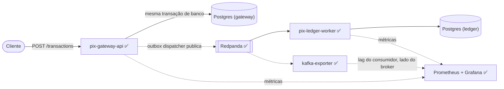

# PIX Payment Gateway

[](https://github.com/leon-lourenco/pix-payment-gateway/actions/workflows/ci.yml)

**Case study:** [leon-lourenco.github.io/pix-payment-gateway](https://leon-lourenco.github.io/pix-payment-gateway/) — o teste de falha real, a arquitetura e as três decisões de design numa leitura de dois minutos.

**Leia em:** [English](README.md) | [Português](README.pt-BR.md) | [Español](README.es.md)

Um gateway de pagamento estilo PIX, construído para demonstrar padrões usados em plataformas de
pagamento reais — idempotência, o outbox pattern, consistência distribuída e observabilidade —
sem depender de nenhum código proprietário de cliente. Tudo aqui roda localmente; não há demo
hospedada nem infraestrutura cobrada por hora.

Este é um projeto de portfólio de [Leonardo Lourenço Gomes](https://www.linkedin.com/in/leonardo-lourenço-gomes),
engenheiro backend sênior, construído em público em fases delimitadas.

## Status

- [x] **Fase 1 — `pix-gateway-api`**: intake idempotente de transações, outbox pattern, Postgres, Testcontainers.
- [x] **Fase 2 — `pix-ledger-worker`**: consumidor Redpanda (compatível com a API do Kafka), ledger de partida dobrada, `docker-compose up` completo.
- [x] **Fase 3 — Observabilidade**: Prometheus + Grafana, documentação Swagger/OpenAPI, um teste de falha injetada real.

As três fases estão implementadas e rodando de ponta a ponta.

## Arquitetura



Dois serviços, cada um com seu próprio banco — sem schema compartilhado entre eles.
`pix-gateway-api` recebe uma transação, persiste, e escreve um evento de outbox na mesma
transação de banco. `pix-ledger-worker` consome esse evento do Redpanda e posta um lançamento de
partida dobrada no ledger. Separar o fluxo dessa forma é o que torna a fase de observabilidade
significativa depois — existe um salto assíncrono de verdade pra instrumentar, não dois serviços
desenhados num quadro branco.

## Decisões de design

### Idempotência garantida pelo banco, não por uma checagem prévia

Uma implementação ingênua verifica "essa chave de idempotência já existe?" e insere se não.
Essa checagem tem uma corrida: duas requisições concorrentes com a mesma chave podem passar pela
verificação antes que qualquer uma tenha escrito algo. A garantia real aqui é a constraint
`UNIQUE` em `idempotency_key`
([V1\_\_init.sql](pix-gateway-api/src/main/resources/db/migration/V1__init.sql)); quem perde a
corrida falha na inserção, e o serviço recorre a ler a linha que o vencedor criou.

Essa leitura de fallback precisa rodar numa **transação separada**. No Postgres, uma vez que uma
instrução falha dentro de uma transação, o resto dela fica abortado até o rollback — então a
leitura não pode acontecer na mesma transação da inserção que falhou.
[`TransactionService`](pix-gateway-api/src/main/java/com/pixgateway/application/TransactionService.java)
usa `TransactionTemplate` explicitamente por esse motivo, em vez de `@Transactional` num único
método.

Coberto por [`TransactionIdempotencyIntegrationTest`](pix-gateway-api/src/test/java/com/pixgateway/TransactionIdempotencyIntegrationTest.java),
que dispara N requisições concorrentes com a mesma chave de idempotência (sincronizadas com um
`CountDownLatch` pra realmente concorrerem entre si) e verifica que exatamente uma transação e
um evento de outbox são criados.

### Outbox pattern

Escrever no banco e publicar num message broker são duas operações separadas; fazer as duas de
forma confiável exige ou uma transação distribuída ou aceitar que uma delas pode falhar
independentemente da outra (o problema do "dual write"). O outbox pattern contorna isso
escrevendo o evento numa tabela na *mesma* transação de banco que a linha de negócio, e depois
um poller separado ([`OutboxDispatcher`](pix-gateway-api/src/main/java/com/pixgateway/infrastructure/outbox/OutboxDispatcher.java))
publica esse evento depois. Se a publicação falhar ou o processo cair no meio do dispatch, o
evento continua ali na tabela, não publicado, pronto pra ser tentado de novo.

O dispatcher não sabe nem se importa com o que está publicando — ele depende de uma porta
[`TransactionEventPublisher`](pix-gateway-api/src/main/java/com/pixgateway/application/port/TransactionEventPublisher.java).
O adapter por trás dela hoje é [`KafkaTransactionEventPublisher`](pix-gateway-api/src/main/java/com/pixgateway/infrastructure/outbox/KafkaTransactionEventPublisher.java),
que publica no Redpanda. Seu `publish()` bloqueia até a confirmação do broker antes de retornar —
o contrato da porta exige isso, já que o dispatcher marca um evento como publicado assim que
`publish()` retorna; um envio "dispara e esquece" que falhasse silenciosamente deixaria um
evento perdido pra sempre.

### Entrega at-least-once, consumo idempotente

Kafka (e Redpanda) garantem entrega at-least-once, não exactly-once: um consumidor pode ver a
mesma mensagem mais de uma vez, geralmente depois de um rebalanceamento. `pix-ledger-worker`
trata isso como o caso normal, não uma exceção. Uma transação sempre produz exatamente um
lançamento `DEBIT` e um `CREDIT`
([`LedgerEntry`](pix-ledger-worker/src/main/java/com/pixledger/domain/LedgerEntry.java)); a
constraint única em `(transaction_id, direction)` faz com que uma mensagem redelivered colida na
inserção do débito e — como as duas inserções acontecem dentro de um único bloco
`TransactionTemplate` em [`LedgerService`](pix-ledger-worker/src/main/java/com/pixledger/application/LedgerService.java) —
o lançamento inteiro sofre rollback antes mesmo de tentar inserir o crédito. O ledger nunca fica
com metade de um par. [`LedgerPostingIntegrationTest`](pix-ledger-worker/src/test/java/com/pixledger/LedgerPostingIntegrationTest.java)
reenvia a mesma mensagem duas vezes contra um broker real e confirma que a segunda vez é um no-op.

### Um banco por serviço

`pix-gateway-api` e `pix-ledger-worker` têm cada um sua própria instância de Postgres — sem
schema compartilhado, sem pool de conexão compartilhado. Os dois só se relacionam através do
contrato JSON do tópico `transactions.created`, não por nenhum código Java ou tabela de banco
que um serviço possa acessar do outro.

### O lag do consumidor precisa ser medido pelo lado do broker, não do cliente

O jeito óbvio de expor o lag do consumidor Kafka é a própria métrica do Micrometer,
`kafka_consumer_fetch_manager_records_lag`, ligada automaticamente pelo Spring for Apache
Kafka — e funciona, até o momento em que para de funcionar: essa métrica é reportada *pelo
próprio processo consumidor*. Pare o `pix-ledger-worker` pra simular uma indisponibilidade e a
métrica não sobe, ela simplesmente para de atualizar, porque não sobra JVM nenhuma pra
reportá-la. Pra um dashboard cujo objetivo inteiro é mostrar o que acontece *enquanto o
consumidor está fora do ar*, isso é inútil.

O [`kafka-exporter`](https://github.com/danielqsj/kafka-exporter) resolve isso perguntando
direto pro Redpanda — `log-end-offset - committed-offset` por consumer group, calculado do lado
do broker, então continua reportando números reais esteja o `pix-ledger-worker` de pé ou não.
O painel do Grafana consulta `kafka_consumergroup_lag_sum{consumergroup="pix-ledger-worker"}`,
não a métrica do Micrometer.

### Dinheiro como centavos inteiros

Os valores são armazenados como `long amountCents`, não como um tipo de ponto flutuante, pra
manter o ledger livre de erro de arredondamento.

## Stack técnica

Java 21, Spring Boot 4.1, Spring Data JPA, Flyway, PostgreSQL, Spring for Apache Kafka,
Redpanda, Testcontainers, JUnit 5, Docker Compose, Prometheus, Grafana, kafka-exporter,
springdoc-openapi (Swagger UI), k6. O Maven Wrapper está commitado nos dois serviços, então
`./mvnw` funciona sem precisar instalar o Maven.

## Como rodar

### Testes

```bash
cd pix-gateway-api    # ou pix-ledger-worker
./mvnw test
```

Os testes de integração de cada serviço sobem Postgres e Kafka reais via Testcontainers — sem
configuração manual — mas precisam de um daemon Docker rodando localmente.

### A stack completa

```bash
docker compose up -d --build
```

Sobe as duas instâncias de Postgres, o Redpanda, e os dois serviços. Na primeira vez, builda as
duas imagens dos serviços (build Maven multi-stage, então baixa as dependências do zero —
espere alguns minutos); depois disso é rápido. Então:

```bash
curl -X POST http://localhost:8080/transactions \
  -H "Content-Type: application/json" \
  -H "Idempotency-Key: $(python3 -c 'import uuid; print(uuid.uuid4())')" \
  -d '{"payerAccount":"alice@example.com","payeeAccount":"bob@example.com","amountCents":5000}'
```

retorna `202` com a transação, e em poucos segundos o mesmo id de transação aparece como um par
balanceado no banco do ledger:

```
$ docker exec pix-payment-gateway-postgres-ledger-1 psql -U pixledger -d pixledger \
    -c "SELECT transaction_id, account, direction, amount_cents FROM ledger_entries;"

            transaction_id            |      account      | direction | amount_cents
--------------------------------------+--------------------+-----------+--------------
 4584deaa-0ce7-495c-b1e0-1495ded01724 | alice@example.com  | DEBIT     |         5000
 4584deaa-0ce7-495c-b1e0-1495ded01724 | bob@example.com    | CREDIT    |         5000
```

Essa é uma execução real contra a stack do compose em 16/08/2026, não um exemplo escrito à mão.

## API

`pix-gateway-api` expõe um único endpoint hoje.

```
POST /transactions
Header: Idempotency-Key: <qualquer string única gerada pelo cliente>
Content-Type: application/json

{
  "payerAccount": "alice@example.com",
  "payeeAccount": "bob@example.com",
  "amountCents": 5000
}
```

Retorna `202 Accepted`:

```json
{
  "id": "5f2c1e2a-...",
  "status": "PENDING",
  "payerAccount": "alice@example.com",
  "payeeAccount": "bob@example.com",
  "amountCents": 5000,
  "createdAt": "2026-08-15T19:04:11.123Z"
}
```

Reenviar a mesma `Idempotency-Key` retorna a transação original em vez de criar uma duplicata,
seja o reenvio sequencial ou concorrente com a requisição original.

O `202` só significa que a transação foi aceita e registrada — a postagem no ledger acontece de
forma assíncrona, um instante depois, quando o `pix-ledger-worker` consome o evento resultante.

O Swagger UI interativo (springdoc-openapi) fica em `http://localhost:8080/swagger-ui.html` com
a stack de pé, com os schemas de requisição/resposta e exemplos documentados no endpoint — não
os defaults gerados automaticamente e sem contexto.

## Observabilidade

O Prometheus (`http://localhost:9090`) faz scrape do `/actuator/prometheus` dos dois serviços
mais do `kafka-exporter`; o Grafana (`http://localhost:3000`, acesso anônimo como admin — essa
stack só se conecta em localhost) vem com um dashboard já provisionado cobrindo throughput de
transações, latência p95 em `POST /transactions`, e o lag do consumidor Kafka do
`pix-ledger-worker`.

### Um teste de falha injetada real

Pra provar que o painel de lag realmente significa alguma coisa, não só que desenha uma linha:
com a stack já processando tráfego, o `pix-ledger-worker` foi derrubado, 15 transações foram
enviadas contra o `pix-gateway-api` (que não se importa se tem alguém consumindo do Redpanda ou
não — o outbox dispatcher publica no Kafka de qualquer jeito), e o worker foi religado.


| Momento | `kafka_consumergroup_lag_sum` |
|---|---|
| Baseline | 0 |
| `pix-ledger-worker` parado, 15 transações enviadas | 15 |
| ~20s depois que `pix-ledger-worker` reiniciou | 0 |

Números reais, extraídos direto da API `query_range` do Prometheus pra essa execução, não
desenhados à mão — e o ledger confirma isso de forma independente: `SELECT COUNT(*) FROM
ledger_entries` mostrou exatamente 2 linhas (uma `DEBIT`, uma `CREDIT`) por transação assim que
o worker se atualizou, nenhum lançamento órfão vindo da indisponibilidade.

Reproduza você mesmo:

```bash
docker compose stop pix-ledger-worker
# envie algumas transações (veja o exemplo de curl acima), depois
docker compose start pix-ledger-worker
# acompanhe drenando:
curl 'http://localhost:9090/api/v1/query?query=kafka_consumergroup_lag_sum{consumergroup="pix-ledger-worker"}'
```

### Load test

[`load-test/create-transaction.js`](load-test/create-transaction.js) é um script k6 (20 req/s,
2 minutos) contra `POST /transactions`:

```bash
docker run --rm --network pix-payment-gateway_default \
  -v "$PWD/load-test:/scripts" grafana/k6 run /scripts/create-transaction.js \
  --env BASE_URL=http://pix-gateway-api:8080
```

## Estrutura do projeto

```
pix-payment-gateway/
├── docker-compose.yml         2 Postgres + Redpanda + kafka-exporter + Prometheus + Grafana + os dois serviços
├── observability/
│   ├── prometheus/            config de scrape
│   └── grafana/provisioning/  provisionamento de datasource + dashboard (JSON)
├── load-test/                 script k6
├── docs/evidence/              gráfico do teste de falha usado acima
├── pix-gateway-api/
│   ├── Dockerfile
│   └── src/main/java/com/pixgateway/
│       ├── domain/            Transaction, OutboxEvent, TransactionStatus
│       ├── application/       TransactionService, port/TransactionEventPublisher
│       └── infrastructure/
│           ├── web/           TransactionController, OpenApiConfig, GlobalExceptionHandler, DTOs
│           ├── persistence/   repositórios Spring Data
│           └── outbox/        OutboxDispatcher, KafkaTransactionEventPublisher
└── pix-ledger-worker/
    ├── Dockerfile
    └── src/main/java/com/pixledger/
        ├── domain/            LedgerEntry, LedgerDirection
        ├── application/       LedgerService, TransactionCreatedEvent
        └── infrastructure/
            ├── persistence/   LedgerEntryRepository
            └── kafka/         TransactionCreatedListener
```
